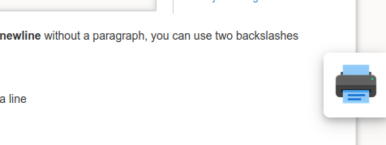
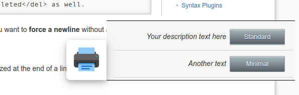

# DokuWiki-Plugin: PDF-Tools

DokuWiki-plugin which offers addition functionality for the dw2pdf-plugin.

## Features

* Optional and configurable slider button to chose a template for pdf-generation
* Configurable pdf-generate button which can be placed in a page
* A set of templates for different purposes which can be installed directly from the admin section
* Upload your own templates in the admin section and option to remove templates
* Additional wrap-containers and some additional syntax for formatting
* Additional replacements which can be used in the templates


## Print Button

Activate a print button (slider) which ist shown a the bottom right of the screen. You can configure the templates which are the display and can be chosen in order to generate a pdf.






## Inline pdf button

Use the ```<pdf>-Tag``` in a document to create an inline button. Pressing this button will generate a pdf with the defined template. Syntax:

    <pdf template-name>
    <pdf template-name quer>

The option ```quer``` creates the pdf in landscape orientation (german word "quer" = horizontal)

Standard parameters for the created pdf are
* toc = 0 (no table of content)
* tpl = ```template-name```
* orientation=landscape (if the keyword ```quer``` is used)


## etikett-Tag

    <etikett>

Inserts an image which is meant for printed documents, where a sticker is to be pasted on.


## Additional wrap containers

If you have the wrap-plugin installed, you can use these addition classes:

    <WRAP maxtabelle>
    Table ist set to 100% width = same as tablewidth-option
    | Content | Another content |
    </WRAP>
    
    <WRAP formular>
    Table without borders
    | Example | Okay |
    </WRAP>

    <WRAP formular2>
    Table with border only on the bottom of the lines
    | Another example | Test |
    </WRAP>

    <WRAP platz>
    Increases the padding of cells in a table
    | Test |
    | Test |
    </WRAP>

    <wrap bigtext>Text scaled to 115%</wrap>

    <wrap smalltext>Text scaled to 90%</wrap>

## Create spaces in empty table cells

Vertical space

    | <abstand1> | Test |
    | <abstand2> | Test |
    | <abstand3> | Test |

Horizontal space

    | Test | <quer1> | <quer2> | <quer3> |


## Set of templates

The pdftools-plugin contains a set of templates which can be installed in the admin section. These templates contain additional replacements:
  
    @AUTHOR@ - Name of the author
    @COMPANY@ - Name of the company which can be configured
    @APPROVER@ - Name of the approve (requires Approve- und ApprovePlus-Plugin)

## Upload pdf-templates

Upload form for uploading your own pdf-templates.

The template files must be placed in a directory, which must bei included in the zip-file. The files are extracted directly into the ```dw2pdf/tpl``` directory. This feature depends on the Linux ```unzip``` programme to work.

## Erase pdf-templates

Button to delete templates from dw2pdf.

## Ideas for coming versions
* online template editor or a configurable template, where setting can be made in the wiki
* configurable GET-Parameters for the ```<pdf>```-Tag and the slider

## Compatibility

Tested with
* PHP **7.3**
* Dokuwiki / **Hogfather**
* [Approve-Plugin](https://www.dokuwiki.org/plugin:approve) / **2021-02-17**
* [dw2pdf / Modified Version](https://github.com/practical-solutions/dokuwiki-plugin-dw2pdf) / **2020-09-16**
* [ApprovePlus-Plugin](https://github.com/practical-solutions/dokuwiki-plugin-approveplus) / **2020-11-23**
